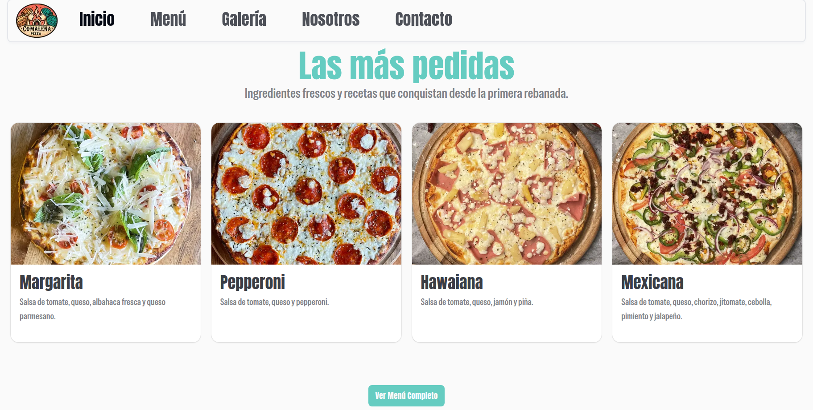
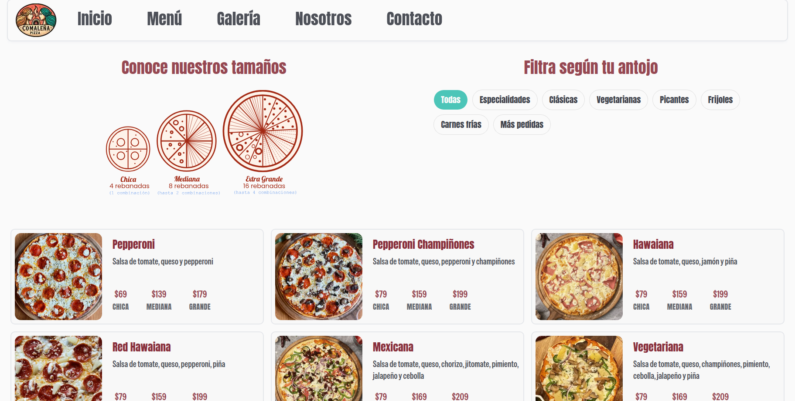

# Comalena Landing Page

## Overview
This repository contains the **Comalena landing page**, built with a **mobile-first approach** to ensure an optimal experience on smartphones and smaller devices before scaling up to tablet and desktop screens.

The landing focuses on clear product presentation, strong visual identity, and smooth navigation, aligned with Comalena’s brand.

---

## Live Demo
🔗 **Deployed on Netlify:**  
https://comalena.netlify.app

---

## Tech Stack
- **Next.js** – Main framework for routing, rendering, and performance optimization.
- **Tailwind CSS** – Utility-first CSS framework used to build a fully responsive, mobile-first layout.
- **shadcn/ui** – Selected UI components adapted and customized to match the project’s design system.

---

## Key Features

### Mobile-First Design
- Layouts are designed starting from mobile screens.
- Progressive enhancements for larger breakpoints.
- Improved readability, spacing, and touch-friendly interactions.

### UI Components
- Reusable components for:
  - Cards
  - Tags and labels
- Selected **shadcn/ui components** adapted to match Comalena’s branding and layout needs.

### Performance & UX
- Optimized layout rendering across all screen sizes.
- Clean and minimal structure focused on conversion and clarity.
- Responsive behavior tested across mobile, tablet, and desktop.

---

## Project Structure
- Components are modular and reusable.
- Layouts are structured to support scalability and future feature additions.
- Styling is centralized to keep consistency across the landing.

---

## Preview
| Home |
|----------|
||

| Menu |
|------|
||

## Running the Project Locally

### Install dependencies
```bash
npm install
```

### Start the development server
```bash
npm run dev
```
### The application will be available at:
```bash
http://localhost:3000
```

## Current Development (dev-beta)

The project is currently under active development in the **`dev-beta`** branch, where new features are being implemented to enable **order placement via WhatsApp**.

### Planned Features

#### WhatsApp Order Integration
- Allow users to place orders directly through WhatsApp.
- Generate a structured message with the order details.
- Send the message to the pizzeria’s phone number.

#### Shopping Cart
- Implement a **cart system** where users can:
  - Review their order before sending.

#### 💬 Order Summary via WhatsApp
- The cart will generate a message including:
  - Selected pizzas
  - Quantities
  - Total summary
  - Delivery information if needed